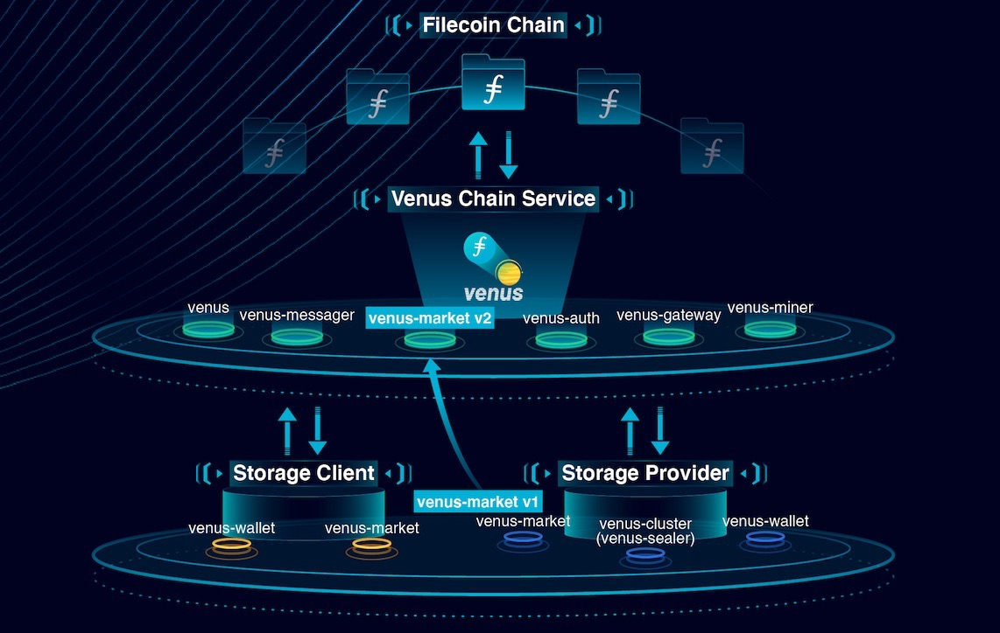

## 背景

考虑到庞大的初始硬件和 Filecoin 质押[投资](https://filscan.io/calculator)以及相关的运营成本，开始 Filecoin 存储提供是一项艰巨的任务。囊括了分布式部署架构，订单服务和算力服务，Venus 将帮助存储提供者，如社区所说，把[全职工作](https://filecoinproject.slack.com/archives/CEGN061C5/p1610810730117900?thread_ts=1610809298.116800&cid=CEGN061C5)变成为一个对运维更加友好的解决方案。希望本教程能让您立即开始存储提供！

## 如何提供存储服务

有两种方法可以开始使用 Venus 来提供存储服务。

1. 部署最少的硬件并获得第三方`Venus`链服务的帐号。欢迎了解`Venus`孵化器[项目](https://venushub.io/zh/incubator/)，加入`Venus`团队提供的免费链服务。(请参阅[这个](join-a-cs.md)教程以了解更多信息)
2. 自行部署`Venus`链服务。(请参阅[这个](deploy-a-cs.md)教程以了解更多信息)

在遵循其余的教程和成功部署后，您可以开始封装扇区，增加算力并通过您对网络存储容量的贡献最终获得区块奖励！

## venus 组件介绍

根据其在挖矿集群中的作用，模块可以大致分为两类：链服务组件和本地组件。链服务可以被认为是开始封装扇区所需的基础。大多数与区块链的交互，如链同步、发送消息、赢得赢票等，都是由链服务处理的。这个想法是许多存储提供者都可以共用一套链服务，从而减少维护成本。本地组件提供了一整套算力服务。如果您选择使用第三方托管的 Venus 链服务，您只要将花费大部分时间在独立模块上。另请注意，`venus-market`和`venus-wallet`模块可以作为链服务或本地组件部署。

| name                                                         | role                                                  | Chain_Service/Local |
| ------------------------------------------------------------ | ----------------------------------------------------- | ------------------ |
| [venus](https://github.com/filecoin-project/venus)           | daemon for chain interactions                         | Chain_Service             |
| [venus-miner](https://github.com/filecoin-project/venus-miner) | block winning and proving                             | Chain_Service             |
| [venus-messager](https://github.com/filecoin-project/venus-messager) | chain message management                              | Chain_Service             |
| [venus-auth](https://github.com/filecoin-project/venus-auth) | utility for authorized use of shared modules          | Chain_Service             |
| [venus-gateway](https://github.com/ipfs-force-community/venus-gateway) | utility for controlled access point of shared modules | Chain_Service             |
| [venus-wallet](https://github.com/filecoin-project/venus-wallet) | addresses/keys management                             | Chain_Service/Local |
| [venus-cluster](https://github.com/ipfs-force-community/venus-cluster) | job scheduling, sealing and proving                   | Local        |
| [venus-market](https://github.com/filecoin-project/venus-market) | deal making                                           | Chain_Service/Local        |
| ~~[venus-sealer](https://github.com/filecoin-project/venus-sealer), [venus-worker](https://github.com/filecoin-project/venus-sealer)~~ | ‼️Deprecated; ~~job scheduling, sealing and proving~~                   | ~~Local~~        |

## 服务架构

下图展示了 venus 模块如何相互交互。



## 硬件要求

在[此处](https://github.com/filecoin-project/community-china/discussions/18)了解有关硬件要求的更多信息。或者参阅我们的[单机配置示例](https://venus.filecoin.io/zh/operation/example-single-box.html)。

:::warning

使用`venus-cluster`时，请参阅`venus-cluster`[性能测试](https://mp.weixin.qq.com/s/AxEaV2iZT8-8jOKyMoFRvA)中，社区成员使用的硬件，并作出对自己的最优调整。如有问题可以寻求[Venus Master](https://venushub.io/master/)的帮助。

:::

## Venus 组件构建

本文档各组件以 `TAG:v1.0.0` 为例说明，实际场景中按需检出。

> 每个组件的构建相互独立，无顺序之分。

### 环境准备

系统需要安装 `Go`,`Rust`等必要软件，可以参考 `lotus` 文档中的相应部分 [building-from-source](https://lotus.filecoin.io/lotus/install/linux/#building-from-source)。

`Venus` 组件均在 `github` 开源，通常用 `git` 管理，`git` 命令使用可参考 [Branching-Remote-Branches](https://git-scm.com/book/en/v2/Git-Branching-Remote-Branches)

部分组件依赖`filecoin-ffi`, `Filecoin`官方提供了编译好的静态库文件。如果需要源码编译此静态库，可参考 [native-filecoin-ffi](https://lotus.filecoin.io/lotus/install/linux/#native-filecoin-ffi),通常`venus-cluster`或`venus-sealer`源码编译此库以提升扇区封装效率。

### venus-auth

```shell script
$ git clone https://github.com/filecoin-project/venus-auth.git
$ cd venus-auth
$ git checkout -b v1.0.0 v1.0.0
$ make 
```

### venus

```shell script
$ git clone https://github.com/filecoin-project/venus.git
$ cd venus
$ git checkout -b v1.0.0 v1.0.0
$ git submodule update --init --recursive
$ make deps
$ make
```

### venus-gateway

```shell script
$ git clone https://github.com/ipfs-force-community/venus-gateway.git
$ cd venus-gateway
$ git checkout -b v1.0.0 v1.0.0
$ git submodule update --init --recursive
$ make
```

如果遇到编译错误：`github.com/dgraph-io/badger/v3@v3.2011.1/fb/BlockOffset.go:6:2: missing go.sum entry for module providing package github.com/google/flatbuffers/go (imported by github.com/dgraph-io/badger/v3/table); to add:
                     go get github.com/dgraph-io/badger/v3/table@v3.2011.1` ,先执行：
 
```shell script
$ go get github.com/google/flatbuffers@v1.12.1
```

### venus-messager

```shell script
$ git clone https://github.com/filecoin-project/venus-messager.git
$ cd venus-messager
$ git checkout -b v1.0.0 v1.0.0
$ make 
```

### venus-miner

```shell script
$ git clone https://github.com/filecoin-project/venus-miner.git
$ cd venus-miner
$ git checkout -b v1.0.0 v1.0.0
$ git submodule update --init --recursive
$ make
```

### venus-market

参考 `venus-market` 项目的 `readme` 文档中 [Build](https://github.com/filecoin-project/venus-market#readme)

### venus-wallet

参考 `venus-wallet` 项目的 `readme` 文档中 [Build](https://github.com/filecoin-project/venus-wallet#readme)

### venus-cluster

参考 `venus-cluster` 项目的文档 `05.快速启用.md` 中 [准备工作](https://github.com/ipfs-force-community/venus-cluster/blob/main/docs/zh/05.%E5%BF%AB%E9%80%9F%E5%90%AF%E7%94%A8.md)

### venus-sealer(将弃用)

```shell script
$ git clone https://github.com/filecoin-project/venus-sealer.git
$ cd venus-sealer
$ git checkout -b v1.0.0 v1.0.0
$ git submodule update --init --recursive
$ make deps
$ make
```
